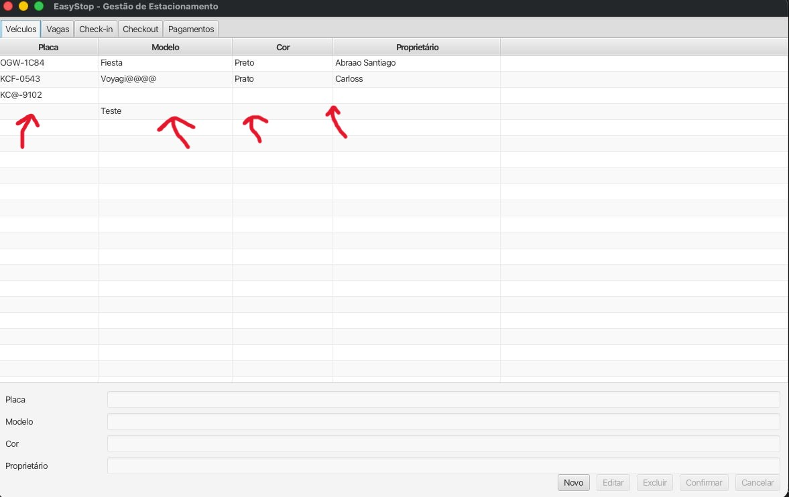

# Bug 2 - Validação de Campo Obrigatório (Placa)

## Descrição
**Funcionalidade:** Cadastrar veículos

## Passos para Reprodução

**DADO** que estou na tela Veículos  
**QUANDO** aperto em NOVO  
**E** em PLACA eu deixo vazio  
**E** clico em CONFIRMAR  
**ENTÃO** é cadastrado o carro sem a placa

## Comportamento Esperado

O sistema avisa que é necessário informar uma placa para o veículo.

## Observação

Note que isso acontece também nos campos **Modelo**, **Cor** e **Proprietário**. Não deve ser possível cadastrar um veículo sem essas informações.
