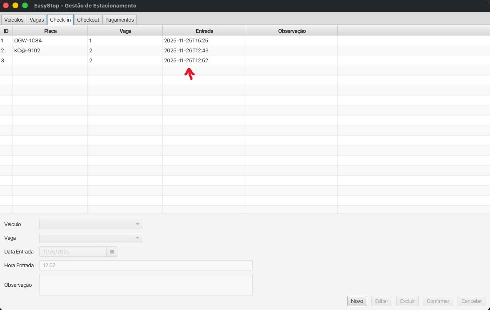

# Bug 5 - Check-In Retroativo Permitido

## Descrição
**Funcionalidade:** Realizar Check-In

## Passos para Reprodução

**DADO** que estou na tela Check-In  
**QUANDO** aperto em NOVO  
**E** em Vaga seleciono a Vaga B  
**E** em Data Entrada eu coloco a data de ontem, 25/11 (o teste está sendo feito no dia **26/11/2025**)
**E** finalizo o Check-In  
**ENTÃO** percebo que permitiu fazer um check-in retroativo

## Comportamento Esperado

O sistema lança uma exceção, alertando não ser possível realizar um check-in retroativo.

## Observação

Isso também ocorre em **Check-Out** e em **Pagamentos**. Também está sendo possível alterar a data para antes do check-in.
