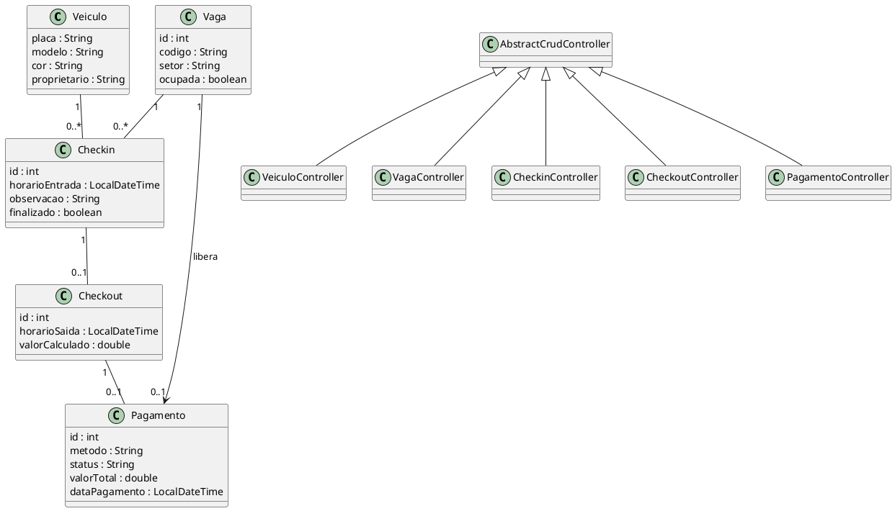

## Diagrama UML - EasyStop

```plantuml
@startuml
skinparam classAttributeIconSize 0

class Veiculo {
  placa : String
  modelo : String
  cor : String
  proprietario : String
}

class Vaga {
  id : int
  codigo : String
  setor : String
  ocupada : boolean
}

class Checkin {
  id : int
  horarioEntrada : LocalDateTime
  observacao : String
  finalizado : boolean
}

class Checkout {
  id : int
  horarioSaida : LocalDateTime
  valorCalculado : double
}

class Pagamento {
  id : int
  metodo : String
  status : String
  valorTotal : double
  dataPagamento : LocalDateTime
}

Veiculo "1" -- "0..*" Checkin
Vaga "1" -- "0..*" Checkin
Checkin "1" -- "0..1" Checkout
Checkout "1" -- "0..1" Pagamento
Vaga "1" --> "0..1" Pagamento : libera

class AbstractCrudController
class VeiculoController
class VagaController
class CheckinController
class CheckoutController
class PagamentoController

AbstractCrudController <|-- VeiculoController
AbstractCrudController <|-- VagaController
AbstractCrudController <|-- CheckinController
AbstractCrudController <|-- CheckoutController
AbstractCrudController <|-- PagamentoController
@enduml
```

O diagrama resume as entidades persistentes, seus relacionamentos e a herança
dos controllers responsáveis pelas operações CRUD em cada módulo.

